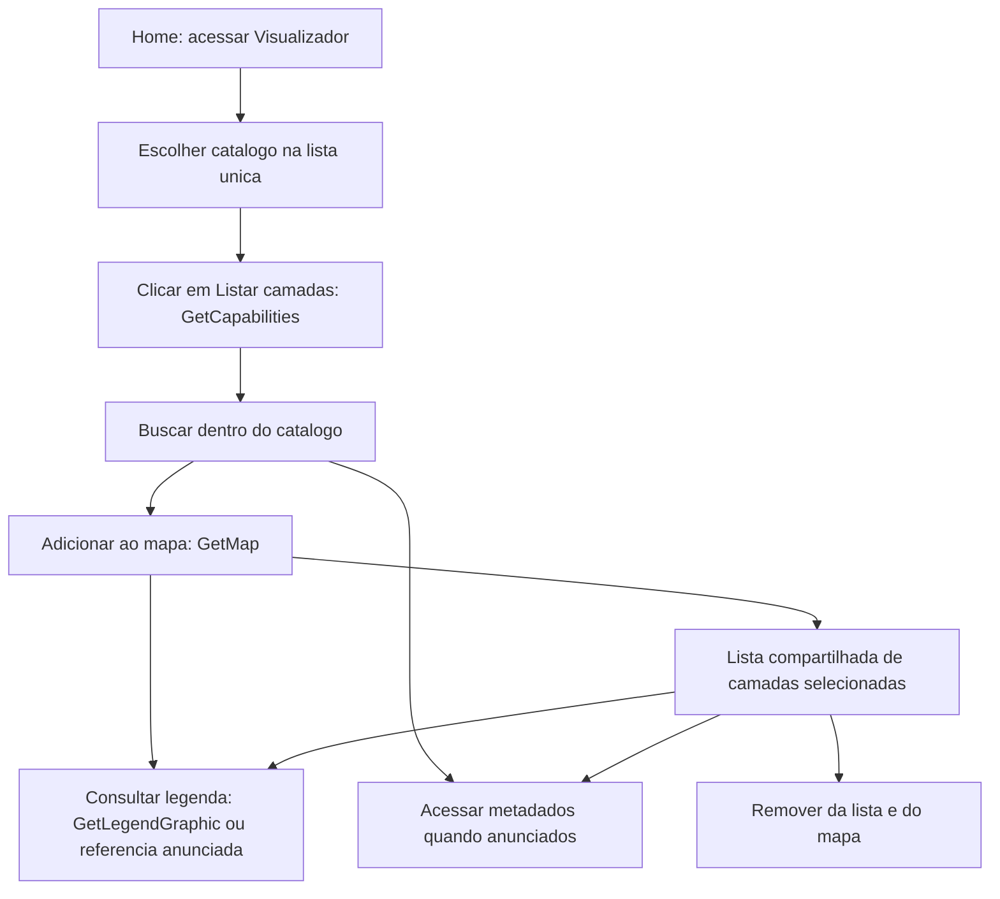

# PRD — Geo_Explorer_INDE

Aplicação de descoberta, busca e visualização de geosserviços da INDE, com evolução incremental.

| Informação | Valor |
| --- | --- |
| Data de criação | 6 de outubro de 2026 |
| Produto | Geo_Explorer_INDE |
| Entrega | Primeiro visualizador WMS |
| Natureza | Requisitos de produto, anteriores ao planejamento da implementação |

## Visão geral do produto

O Geo_Explorer_INDE é uma aplicação web para facilitar a descoberta, consulta e visualização interativa de geosserviços padronizados pela OGC e publicados pelas instituições participantes da Infraestrutura Nacional de Dados Espaciais (INDE), incluindo o IBGE.

A aplicação atua como um agregador de endereços de serviços e um cliente de exploração no navegador. Os dados e serviços permanecem sob responsabilidade das instituições publicadoras. A interface deve atender tanto pessoas sem conhecimento de geoprocessamento quanto profissionais que precisam consultar detalhes técnicos.

A próxima entrega permite escolher diretamente um catálogo em uma lista única, clicar em “Listar camadas”, buscar dentro dele e adicionar camadas ao mapa e à lista compartilhada de selecionadas. O OpenLayers permanece como cliente cartográfico. O catálogo adaptado existente preserva as subdivisões dos serviços do IBGE. Consulta por clique via GetFeatureInfo será um incremento posterior.

## Objetivos e impacto

### Ajuste aprovado em 7 de outubro de 2026

Ao acessar os metadados de uma camada WMS, abrir a rota interna `/metadado` com o endereço anunciado em `MetadataURL`. `MetadataViewer.svelte` deve buscar e apresentar o registro de forma legível, tanto a partir da descoberta quanto da lista de camadas selecionadas. Se o registro estiver indisponível ou não puder ser interpretado, informar a falha e oferecer o endereço original. A ação continua ausente quando não há `MetadataURL` utilizável.

Uma falha confirmada de GetMap remove a camada do mapa e da lista compartilhada de selecionadas, liberando uma nova tentativa de inclusão. O aviso desaparece automaticamente após dois segundos e permanece visível durante esse prazo mesmo após a remoção automática. Cada nova falha tem seu próprio prazo; cancelamentos por navegação ou substituição de requisição não removem a seleção nem geram aviso. Uma falha de legenda continua preservando a camada.

No visualizador, ocultar o cabeçalho horizontal. O painel lateral oferece Home e recolhimento no topo; um controle sobre o mapa permite reabri-lo sem perder descoberta ou seleção. As seções WMS e Camadas selecionadas são expansíveis. A lista WMS preserva recursivamente os grupos do GetCapabilities: nós sem Name organizam seus descendentes e não podem ser adicionados; nós com Name mantêm ações de inclusão e metadados, inclusive quando possuem filhos. Catálogos sem grupos intermediários mantêm a lista simples. A busca preserva os ancestrais dos resultados. Esta decisão substitui a exigência de cabeçalho horizontal dentro do visualizador; a Home mantém sua navegação. WFS continua fora do escopo.

- **Descoberta centralizada:** reunir o acesso aos catálogos WMS fornecidos pela API adaptada da INDE, sem exigir instalação de software de geoprocessamento de desktop.
- **Busca acessível:** permitir encontrar camadas no catálogo escolhido com linguagem simples e identificação clara da instituição de origem.
- **Interpretação dos dados:** apresentar informações disponíveis no GetCapabilities, acesso aos endereços de metadados e legenda quando disponíveis. Consulta por ponto será acrescentada posteriormente.
- **Visualização interativa:** permitir explorar a representação cartográfica das camadas e compreender as informações retornadas pelo serviço.
- **Tratamento compreensível de falhas:** distinguir serviços indisponíveis, resultados vazios e recursos não suportados durante a exploração, sem prometer monitoramento contínuo dos servidores.

O impacto esperado é reduzir o esforço necessário para passar da descoberta de um catálogo à compreensão de uma camada no mapa. Os exemplos de aceitação deste documento definem os sinais verificáveis da primeira entrega; não há promessa de desempenho independente dos serviços externos.

## Evolução prevista e possibilidades

| Área | Tratamento neste produto |
| --- | --- |
| WMS | Próxima entrega: descoberta, busca por catálogo, inclusão no mapa, lista compartilhada, acesso a metadados e legenda. GetFeatureInfo fica para depois. |
| WFS | Etapa posterior confirmada como direção; requisitos e versões serão definidos nessa etapa. |
| WCS | Possibilidade futura, sem compromisso de implementação. |
| Metadados ISO associados a WMS | Leitura amigável dos registros interpretáveis anunciados em MetadataURL pela rota `/metadado`. |
| CSW | Descoberta e análise de registros de catálogo permanecem como possibilidade futura. |
| Diagnósticos de links e qualidade, estatísticas e relatórios CSV/PDF | Possibilidades a avaliar; não constituem requisitos atuais. |
| Outros renderizadores e bibliotecas cartográficas | Não há adoção aprovada de MapLibre GL, Proj4 ou deck.gl; o cliente desta entrega é OpenLayers. |

O texto de referência do projeto DBDG INDE contribui com a visão de descoberta centralizada e interpretação dos serviços. Seu escopo completo, suas versões de dependências e suas afirmações de desenvolvimento não são transferidos automaticamente para o Geo_Explorer_INDE. A arquitetura e as dependências deste projeto estão documentadas em `src/docs/architecture.md` e nos arquivos de configuração existentes.

## Objetivo e escopo

**Objetivo:** permitir que pessoas encontrem camadas das instituições participantes da INDE, visualizem mapas e interpretem legendas e informações associadas em uma interface simples.

**Autoridade de produto:** requisitos da conversa com o responsável pelo projeto. Este documento cobre o primeiro visualizador, baseado em WMS. Outros visualizadores pertencem a etapas futuras.

**Pontos em aberto para incrementos posteriores:** visibilidade, transparência, ordem de sobreposição, enquadramento por extensão e comportamento da consulta por ponto. Não bloqueiam a próxima entrega.

## Requisitos de produto

### Contexto e problema

A INDE reúne endereços de geosserviços de diversas instituições. Para explorar seus dados, o usuário precisa descobrir um serviço, conhecer suas camadas e interpretar o mapa resultante. O produto deve tornar esse percurso acessível sem exigir conhecimento dos nomes das operações OGC.

O projeto já contém uma base em Svelte/SvelteKit e OpenLayers, componentes para WMS e uma API local que adapta o catálogo da INDE. Essa adaptação desdobra a entrada geral do IBGE em catálogos específicos e mantém as demais instituições. A existência dos componentes não implica funcionamento verificado.

### Público

- A1. Pessoa sem formação em geoprocessamento, que deseja encontrar e explorar dados em um mapa.
- A2. Pessoa com experiência em geoprocessamento, que também precisa acessar identificação, origem e detalhes técnicos das camadas.

Analistas de geoinformação e pesquisadores são exemplos de A2: desejam encontrar dados, interpretar atributos retornados e explorar sua representação no mapa. Desenvolvedores e integradores podem utilizar os detalhes técnicos sob demanda, sem que isso implique ferramentas de validação de esquemas ou inspeção avançada nesta entrega. Gestores de catálogo e auditores aparecem como público potencial de uma evolução de diagnóstico, ainda sem casos de uso aprovados para essa área.

### Decisões confirmadas

- Atender público misto, com linguagem simples e detalhes técnicos disponíveis sob demanda.
- Evoluir de forma incremental, entregando exclusivamente o visualizador WMS nesta etapa. WFS será incluído posteriormente; WCS é uma possibilidade futura, ainda sem compromisso de implementação.
- Usar uma lista única de catálogos, identificados pela instituição e subdivisão. Não exigir uma seleção anterior de instituição. Executar GetCapabilities somente ao clicar em “Listar camadas”, após escolher o catálogo.
- Usar `/api/inde/catalogos-servicos/ibge`, a API adaptada existente da INDE que desdobra o IBGE por departamento e mantém as demais instituições. Não substituir essa fonte pela rota de catálogo geral sem adaptação.
- Diferenciar por departamento somente o IBGE; apresentar os catálogos das demais instituições conforme fornecidos pela INDE, sem criar subdivisões adicionais.
- Contemplar GetCapabilities, GetMap e legenda na próxima entrega; reservar GetFeatureInfo para um incremento posterior.
- Usar uma lista compacta com título e ações por camada; manter uma seção própria de camadas selecionadas.
- Manter a lista de selecionadas em estado reativo compartilhado do Svelte, com tipo explícito WMS nesta etapa.
- Oferecer página inicial com menu horizontal Geo_Explorer_INDE e somente Home e Visualizador; no visualizador, usar navegação no painel lateral.

### Requisitos de descoberta

- R1. Apresentar todos os catálogos WMS em uma lista única a partir da API local, com instituição e subdivisão identificáveis, preservando as subdivisões do IBGE e sem seleção prévia de instituição.
- R2. Após escolher um catálogo, permitir clicar em “Listar camadas” para executar GetCapabilities. A seleção isolada não inicia a requisição. Listar camadas exibíveis e distinguir grupos sem nome.
- R3. Permitir busca textual pelo título e nome das camadas dentro do catálogo selecionado; busca vazia apresenta a lista completa desse catálogo.
- R4. Exibir estados de carregamento, catálogo sem camadas, busca sem resultados e falha de acesso, com possibilidade de tentar novamente.

### Requisitos de visualização e interpretação

- R5. Oferecer um botão de inclusão ao lado do nome de cada camada exibível. Ao clicar, adicioná-la ao mapa por GetMap e à lista compartilhada de camadas selecionadas, mantendo essas duas representações sincronizadas.
- R6. Identificar as camadas exibidas pelo título, instituição e catálogo de origem.
- R7. Permitir visualizar a legenda associada ao estilo exibido, usando a referência anunciada pelo serviço ou GetLegendGraphic quando disponível. Informar quando a legenda não estiver disponível.
- R8. Em incremento posterior, permitir consultar informações alfanuméricas por clique no mapa via GetFeatureInfo, quando suportado e a camada for consultável.
- R9. Em incremento posterior, distinguir estados e falhas da consulta por ponto, sem impedir a visualização do mapa.
- R10. Apresentar detalhes técnicos sob demanda, incluindo nome da camada e endereço do serviço; a navegação atual usa rótulos como “Camadas”, “Metadados” e “Legenda”.
- R11. Manter as camadas selecionadas ao trocar o catálogo de descoberta, permitindo combinar camadas WMS de catálogos diferentes.
- R15. Quando MetadataURL/OnlineResource anunciar um endereço utilizável, abrir `/metadado` em nova aba a partir da descoberta ou da lista de selecionadas. A página apresenta o registro ISO interpretável por `MetadataViewer.svelte`; em caso de falha ou formato não interpretável, informa o problema e oferece acesso ao endereço original. Sem endereço utilizável, não exibir a ação.
- R16. Manter uma única lista reativa compartilhada entre descoberta, mapa e painel de selecionadas. Cada entrada identifica tipo WMS, origem e camada. A gestão admite evolução futura de tipos, sem implementar WFS agora. A remoção retira a camada do mapa e da lista.
- R17. Oferecer Home como página de entrada, com barra horizontal e apenas Home e Visualizador. No visualizador, ocultar essa barra e oferecer retorno à Home no topo do painel lateral.
- R18. Exibir camadas em linhas compactas, preservando a hierarquia de grupos expansíveis do GetCapabilities e ancestrais dos resultados de busca. Grupos sem Name não são adicionáveis; nós com Name mantêm ações, inclusive se tiverem filhos. Na descoberta, oferecer metadados quando disponíveis e inclusão no mapa; nas selecionadas, metadados, legenda e remoção. O painel e suas seções WMS e Camadas selecionadas podem ser recolhidos sem perder o estado.

### Propostas para revisão

Os requisitos abaixo completam o uso cotidiano do mapa, mas ainda precisam de confirmação do responsável pelo produto.

- R12. Em incremento posterior, permitir mostrar e ocultar camadas, ajustar transparência e alterar a ordem de sobreposição. A remoção já pertence ao escopo confirmado de R16.
- R13. Oferecer navegação de mapa com zoom e deslocamento, além de enquadrar uma camada quando sua extensão geográfica estiver disponível.
- R14. Na consulta por clique, usar uma camada ativa escolhida pelo usuário; manter o resultado identificado pela camada e pelo ponto consultado.

### Fluxo principal

- F1. **Entrada:** o usuário abre Home e acessa Visualizador. **Percurso:** escolhe um catálogo na lista única, clica em “Listar camadas”, busca uma camada e clica no ícone de inclusão. **Resultado:** a camada aparece no mapa e na lista compartilhada de selecionadas.
- F2. **Entrada:** a lista de descoberta ou de selecionadas está visível. **Percurso:** o usuário acessa metadados quando anunciados; nas selecionadas, abre a legenda ou remove a camada. **Resultado:** acessa o recurso correspondente ou remove a camada da lista e do mapa.

**Composição confirmada:** barra horizontal Home/Visualizador apenas na Home. O visualizador ocupa a tela com mapa e painel lateral recolhível, cujo topo oferece Home e fechar. As seções WMS e Camadas selecionadas usam Accordion. Dentro do WMS, grupos usam uma árvore compacta com recuo, pastas e controles de abrir/fechar, sem Accordions por grupo; camadas mantêm título e ícones de ação. As referências não autorizam outras ferramentas ou protocolos.

### Exemplos de aceitação

Os cenários de aceitação relevantes devem orientar testes escritos e executados antes da implementação de cada incremento, com confirmação da falha esperada e posterior aprovação. Os fluxos de interface podem ser cobertos com Playwright; as respostas dos serviços externos devem ser simuladas para manter os testes determinísticos.

- AE1. **Cobre R1–R3.** Há uma única seleção de catálogo. Escolher IBGE/CCAR não consulta GetCapabilities até clicar em “Listar camadas”; depois, a busca filtra somente as camadas desse catálogo.
- AE2. **Cobre R4.** Se GetCapabilities falhar, a interface identifica o catálogo com problema e oferece nova tentativa, sem apresentar a falha como lista vazia.
- AE3. **Cobre R5–R6, R16.** Ao clicar em adicionar, o mapa exibe a representação recebida e a lista compartilhada mostra a mesma camada com título e origem. Removê-la retira ambas as representações.
- AE4. **Cobre R7.** Se a legenda estiver disponível, ela corresponde ao estilo exibido; se não estiver, a interface informa a ausência e mantém o mapa utilizável.
- AE5. **Posterior; cobre R8–R9.** Uma camada não consultável pode ser visualizada, mas não oferece consulta de atributos.
- AE6. **Posterior; cobre R8–R9.** Consulta vazia e falha de comunicação produzem mensagens distintas.
- AE7. **Cobre R10.** O usuário consegue encontrar, adicionar e explorar uma camada sem preencher manualmente uma URL ou conhecer nomes de operações OGC.
- AE8. **Cobre R11, R16.** Trocar de catálogo mantém as camadas já selecionadas no mapa e na lista compartilhada.
- AE9. **Cobre R15, R18.** Camada com MetadataURL utilizável abre `/metadado` na descoberta e nas selecionadas; o registro interpretável aparece de forma legível e um registro inválido mostra uma falha recuperável. Sem endereço, a ação não é oferecida.
- AE10. **Cobre R17.** A entrada do sistema é Home, cujo menu oferece somente Home e Visualizador. O visualizador não exibe esse menu e oferece Voltar para Home no painel.
- AE11. **Cobre R18.** Esconder e reabrir o painel preserva catálogo, busca e selecionadas, e libera a largura para o mapa. As seções podem ser abertas e fechadas pelo teclado. Grupos aninhados respeitam a árvore WMS; a busca mantém seus ancestrais e expande os resultados.

### Limites da primeira entrega

A descoberta usa uma lista única de catálogos e listagem explícita por botão. GetFeatureInfo, busca global entre instituições, visualizadores WFS/WCS/CSW, download de dados, edição de feições e análises espaciais ficam fora da próxima entrega. Contas, persistência de mapas e compartilhamento de mapas entre usuários não integram o escopo; o estado compartilhado entre componentes de R16 é obrigatório e não equivale a esse compartilhamento externo.

Também ficam fora desta entrega monitoramento de saúde dos nós, varredura de links, diagnóstico de registros CSW, validação de esquemas, estatísticas de palavras-chave, busca espacial por BBOX e exportação de inventários ou relatórios CSV/PDF. O produto atual é de leitura e consulta, sem autenticação, controle de permissões ou banco de dados próprio como requisito. Não há garantia de disponibilidade nem responsabilidade pela correção dos serviços de terceiros. O modelo de persistência de futuras funcionalidades será decidido quando seu escopo for definido.

### Dependências e qualidade

Os serviços são operados por instituições externas e podem ter disponibilidade, formatos e capacidades diferentes. O visualizador deve respeitar essas capacidades e apresentar falhas de forma localizada, mantendo os demais recursos utilizáveis.

GetFeatureInfo é opcional no WMS. GetLegendGraphic não é garantido em todo serviço WMS; a legenda também pode ser anunciada nos metadados do estilo. GetMap retorna uma representação do mapa, não um conjunto de feições para edição ou download.

A interface deve oferecer rótulos claros, controles acessíveis por teclado e estados compreensíveis sem depender exclusivamente de cor. Não se estabelece prazo de resposta dos servidores externos; tempos de espera e limites operacionais serão definidos no planejamento.

A avaliação em `src/docs/seguranca-proxy.md` registra limites atuais de transporte e uma proposta de proteção contra sobrecarga, ainda dependente da hospedagem. Nas etapas futuras de WFS/WCS, avaliar também volume, memória e processamento no navegador; os limites atuais de WMS não serão automaticamente reutilizados.

### Questões em aberto

**Para incrementos posteriores:** R12–R14 e a escolha de camada ativa versus todas as visíveis em GetFeatureInfo. Essas questões não bloqueiam a próxima entrega.

**Resolver na implementação planejada:** compatibilidade de versões e projeções WMS, tratamento de respostas externas, acesso aos serviços e consolidação dos componentes existentes, conforme `src/docs/implementacao-wms.md`. Formatos e comportamento de GetFeatureInfo serão tratados somente no incremento posterior dessa operação. Verificar os endpoints reais e seu comportamento; testes com respostas simuladas não comprovam sua disponibilidade.

### Referências

- Trecho do PRD do projeto DBDG INDE, fornecido pelo responsável pelo produto nesta conversa: referência para visão geral, objetivos e públicos potenciais, conciliada com o escopo incremental deste documento.

- API adaptada: `src/routes/api/inde/catalogos-servicos/ibge/+server.ts`.
- Componentes existentes: `src/lib/components/openlayers/wms/` e `src/lib/ogc/wms/wmsCapabilities.ts`.
- [Catálogo de Geosserviços da INDE](https://inde.gov.br/CatalogoGeoservicos).
- [Especificação OGC WMS 1.3.0](https://docs.ogc.org/is/06-042/06-042.pdf).
- [Referência WMS do GeoServer](https://docs.geoserver.org/latest/en/user/services/wms/reference/).
- [GetLegendGraphic no GeoServer](https://docs.geoserver.org/latest/en/user/services/wms/get_legend_graphic/index.html).
