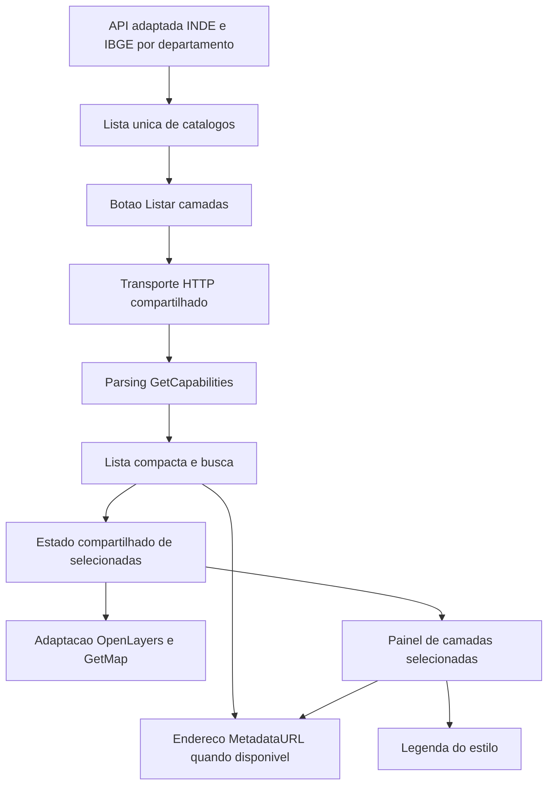

# Arquitetura do Geo_Explorer_INDE

O PRD em `src/docs/PRD.md` define o produto; `agents.md` define as regras de trabalho. Este documento distingue código existente, organização planejada e lacunas conhecidas. A documentação descreve limitações existentes sem autorizar sua reprodução.

## Tecnologias e escopo

SvelteKit, Svelte, TypeScript, Tailwind CSS, shadcn-svelte, lucide-svelte e OpenLayers, nas versões de `package.json` e `package-lock.json`. Apenas WMS é integrado nesta etapa. WFS será posterior; WCS é uma possibilidade. GetFeatureInfo também é um incremento posterior, apesar de haver código legado relacionado.

## Estrutura existente

| Área | Responsabilidade |
| --- | --- |
| `src/routes/` | Páginas, composição e endpoints SvelteKit. |
| `src/routes/api/inde/` | Catálogo da INDE e adaptação do IBGE por departamento. |
| `src/routes/api/get/` | Proxy de transporte HTTP. |
| `src/lib/inde/catalogos.ts` | Validação e normalização da lista de catálogos WMS. |
| `src/lib/ogc/wms/` | Modelos e parsing WMS; `descoberta.ts` é o caminho comum de parsing, listagem e filtro; a entrada de parsing em `wmsCapabilities.ts` delega a esse caminho. |
| `src/lib/metadata/` | Construção do link interno para leitura do registro anunciado em MetadataURL. |
| `src/lib/request/` | Transporte HTTP compartilhado, timeout e alternativa pelo proxy. |
| `src/lib/shared/` | Estado reativo compartilhado, incluindo `mapper_ol` e `layerManager.selectedLayers`. |
| `src/lib/components/openlayers/` | Apresentação e adaptação cartográfica. |
| `tests/e2e/` | Cenários Playwright com respostas HTTP simuladas. |

`src/lib/types/` é uma organização prevista pelas regras, ainda não existente. O parser ISO usado por `MetadataViewer.svelte` permanece nesse componente nesta etapa. Os parsers que usam DOMParser dependem de ambiente com DOM e não devem ser importados por endpoints server-side.

## Rotas e estado atual

| Rota | Situação observada |
| --- | --- |
| `/` | Home com apresentação do produto e acesso ao visualizador; cabeçalho compartilhado oferece somente Home e Visualizador. |
| `/visualizador/ol` | Lista única de catálogos, botão de listagem, busca e linhas compactas; inclui camadas no mapa e no painel compartilhado de selecionadas. |
| `/metadado?link=...` | Apresenta o registro ISO anunciado em MetadataURL por meio de `MetadataViewer.svelte`, com acesso ao endereço original quando a leitura falha. |
| `/api/inde/catalogos-servicos` | Catálogo geral da INDE sem desdobramento do IBGE. |
| `/api/inde/catalogos-servicos/ibge` | Fonte obrigatória do visualizador: mantém demais instituições e desdobra IBGE em CGMAT, CCAR, CGED, CGEO, CETE, CMA/CREN, BDIA e PNADC. |
| `/api/get?url=...` | Proxy usado como alternativa de transporte. |

`MapaExplorador.svelte` inicializa e descarta o mapa OpenLayers no navegador. Reconcilia `layerManager.selectedLayers` com objetos `ImageLayer`/`ImageWMS`, mantidos em um índice local do renderizador. `selecionadas.ts` centraliza inclusão e remoção na lista compartilhada: entradas WMS preservam origem, endpoint de GetMap, versão, formato, projeção, estilo e legenda. A troca de catálogo preserva a seleção; a volta pela Home reconstrói as camadas. O mapa e a fachada legados continuam fora da composição desta rota, com tipos e funções incompletos.

## Organização da entrega atual

A Home mantém navegação horizontal com apenas Home e Visualizador. O layout oculta o cabeçalho nas rotas do visualizador. O painel oferece Voltar para Home e Esconder painel no topo; o mapa oferece Mostrar painel quando recolhido. O painel é ocultado sem desmontar a descoberta ou o mapa, preservando estado. No celular sobrepõe o mapa; no desktop participa da largura disponível.

`SecaoExpansivel.svelte`, em `components/ui/accordion/`, usa as primitivas acessíveis Bits UI que fundamentam o Accordion shadcn-svelte. As seções WMS e Camadas selecionadas começam abertas. `ArvoreWMS.svelte` apresenta recursivamente listas aninhadas. `GrupoCamadasWMS.svelte` oferece abertura/fechamento com `aria-expanded`, pastas e recuo; não usa Accordion nos grupos internos. `AcoesCamadaWMS.svelte` oferece ações somente para nós com Name. Um único nó raiz sem Name é tratado como contêiner do serviço; grupos intermediários permanecem visíveis. `filtrarArvoreWMS` preserva ancestrais dos resultados, e a busca expande esses grupos. Nós nomeados com filhos continuam adicionáveis. A lista compartilhada de selecionadas e o transporte permanecem os mesmos.

O usuário escolhe um catálogo na lista única e aciona “Listar camadas”.

### Responsabilidades e contratos

- Integração INDE normaliza catálogos e preserva departamentos e origem; não agrupa o IBGE em uma entrada única.
- O desdobramento por departamento é exclusivo do IBGE. As demais instituições mantêm a organização fornecida pela INDE.
- Domínio WMS interpreta versão, operações, camadas, estilos, MetadataURL, projeções e herança aplicável; fornece dados independentes do renderizador. Consolidar os parsers existentes em vez de duplicar regras de protocolo.
- Transporte centraliza requisições, falhas, timeout e cancelamento. Componentes não implementam proxies próprios.
- Estado compartilhado mantém a fonte única de camadas selecionadas. As entradas WMS carregam identificação estável por serviço e nome de camada, título, origem, endpoint, versão, estilo, metadados e legenda. A evolução de tipos pode admitir WFS futuramente, mas não adiciona comportamento WFS agora.
- A adaptação OpenLayers cria e remove objetos de mapa a partir dessa lista. Referências de OpenLayers permanecem no navegador e fora do domínio OGC; evitar proxy reativo profundo sobre instâncias do renderizador.
- Ações de inclusão e remoção atualizam mapa e lista conjuntamente; trocar o catálogo de descoberta não remove camadas selecionadas. Ao desmontar, liberar listeners e recursos; ao remontar, reconstruir camadas a partir do estado da sessão. Não há persistência após recarregar a página.
- Apresentação usa linhas compactas, ícones com nomes acessíveis e ações condicionadas aos dados disponíveis. Metadados abrem `/metadado` em nova aba; `MetadataViewer.svelte` interpreta registros ISO MD_Metadata da URL anunciada e oferece o endereço original em caso de falha. A descoberta CSW permanece fora desta entrega.

## Lacunas que precisam ser tratadas

O proxy valida hosts anunciados pelo catálogo adaptado, protocolo, credenciais e porta. `proxySeguro.ts`, exclusivo do servidor, verifica todas as respostas DNS e fixa o endereço público na conexão; não segue redirecionamentos. As requisições têm prazo de 65 segundos e limite de resposta de 32 MiB. A consulta ao catálogo tem prazo de 20 segundos. Não há desativação global de TLS.

Conforme decisão do responsável, uma falha reconhecida de certificado pode gerar nova tentativa sem validação TLS apenas na conexão HTTPS com host validado pelo catálogo. DNS público, limite de resposta e bloqueio de redirecionamentos continuam obrigatórios. A exceção reduz a garantia de identidade do servidor. Antes de publicação, avaliar limites de requisições para evitar sobrecarga do proxy.

`transporte.ts` combina cancelamento e timeout até o corpo completo. O helper `get.ts` usa o proxy somente para falhas de rede no navegador; erros HTTP não são repetidos. A URL codificada é recuperada por `searchParams.get` no servidor. GetMap utiliza esse transporte para carregar imagens. Uma falha confirmada remove a camada pela ação compartilhada `removerWMS`, sincronizando mapa, selecionadas e botão de inclusão para permitir nova tentativa. Cancelamentos por navegação ou substituição de imagem preservam a seleção; falhas de legenda também. Requisições de capabilities são canceladas ao mudar de catálogo ou desmontar a página; respostas antigas não substituem a descoberta atual.

Na inclusão inicial, GetMap usa `STYLES=` para solicitar o estilo padrão do servidor WMS; a ordem dos estilos anunciados em GetCapabilities não identifica qual é o padrão. Estilos com Name permanecem no modelo, incluindo herança, para uma futura escolha explícita. Sem um estilo nomeado selecionado, a legenda é solicitada por GetLegendGraphic sem o parâmetro opcional `STYLE`, quando a operação e o formato estão anunciados. Uma LegendURL associada a um estilo nomeado não é apresentada como legenda do estilo padrão. Avisos de falha de GetMap desaparecem após dois segundos, independentemente da remoção automática da seleção; seus temporizadores são reiniciados por nova falha e descartados no sucesso ou desmontagem.

Há imports legados de dependências ausentes e tipagem incompleta em módulos fora do incremento atual. Não suprimir diagnósticos nem flexibilizar TypeScript estrito para contorná-los. Corrigir os módulos necessários ao fluxo e relatar os problemas restantes. A avaliação de sobrecarga está em `src/docs/seguranca-proxy.md`; as decisões futuras sobre volume e memória em WFS/WCS estão em `src/docs/reflexoes-dados-volumosos.md`, sem ampliar a entrega atual.

## Validação

Playwright está configurado em `playwright.config.ts`, com navegador local e cenários em `tests/e2e/`, usando fixtures XML e imagens. Há scripts `test`, `test:e2e` e `test:e2e:install`; não há script de lint. Testes unitários exercitam catálogo, transporte e política de destinos e certificados. A suíte de interface cobre o fluxo revisado e variantes WMS 1.1.1/1.3.0.

No incremento de painel e árvore de 7 de outubro, os 19 cenários Playwright e os oito testes unitários passaram. O servidor dos testes compila e inicia `vite preview`, para evitar interferência de recargas do ambiente de desenvolvimento. A compilação de produção passou, e a verificação de tipos mantém os mesmos diagnósticos legados. A inspeção visual inclui desktop e celular.

A verificação inicial encontrou 178 erros e 15 avisos em 38 arquivos. A verificação desta entrega apresenta 96 erros e 15 avisos em 22 arquivos, concentrados em módulos legados; não é uma aprovação global de tipos. Não há diagnóstico novo nos módulos do fluxo implementado. Os oito testes unitários e os 19 cenários Playwright passaram com respostas simuladas. A geração de produção compilou. Foram inspecionadas capturas em desktop e celular; as imagens dos serviços são fixtures, o que não comprova disponibilidade dos endpoints públicos.

Cada incremento começa por teste relevante com falha esperada e termina com nova execução, `npm run check` e, para integrações, `npm run build`. Validar o mapa e a interface em desktop e celular. Estado futuro e lacunas não devem ser apresentados como funcionalidades concluídas.
